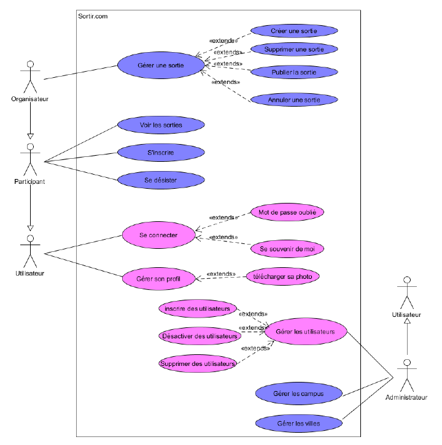
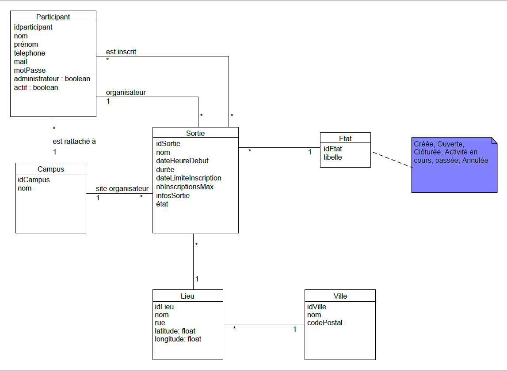
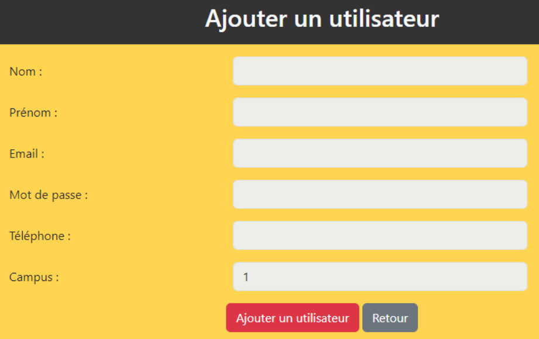
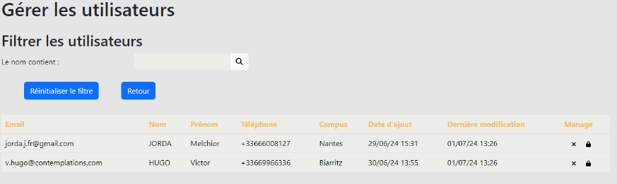
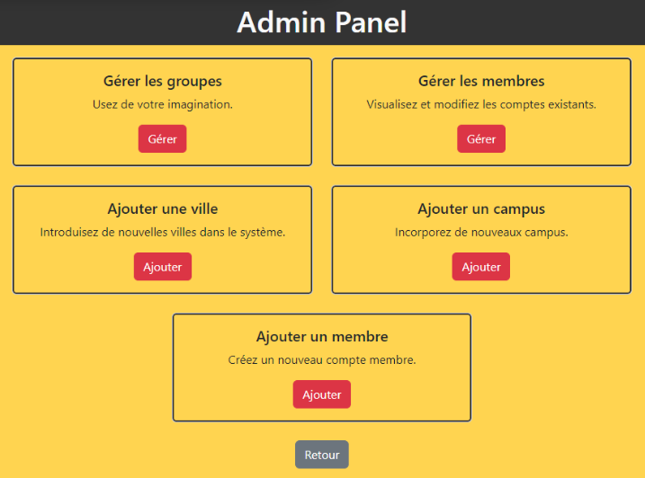
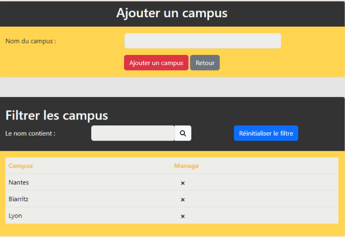
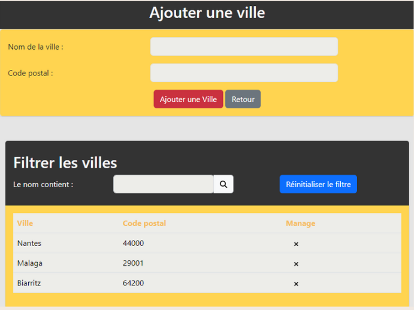

# ProjetSortir

## Links
- [Version française](README/README_FR.md)
- [Versión en Español](README/README_ES.md)

## Description
ENI wishes to develop a web platform for its active trainees and former trainees, allowing them to organize outings. The platform is private, and registration will be managed by the administrator(s). Outings and participants are linked to a campus to facilitate geographical organization of events.

## Problem
The large number of trainees and their distribution across different campuses make it difficult to organize events or outings. The identified issues are:
- There is no official communication channel to propose or consult outings.
- Current tools do not allow managing invitations based on trainees' geographical location or interests, nor managing the number of guests or the registration deadline.

A successful solution would allow the organization of these outings and anticipate the number of participants, the location of the outing, and other necessary information for the smooth running of the activity.

## Objective
To set up a web platform for trainees in training and former trainees that allows organizing outings during off-training time.

## Technologies Used
- Symfony
- PHP
- Database Management (MySQL)
- Wamp
- PhpMyAdmin
- HTML/CSS
- Bootstrap
- Javascript
- Twig
- GitHub
- PhpStorm

## Diagrams
- **Use Case Diagram**: 
- **Class Diagram**: 

## Usage
With this application, users can:
- Create an outing
- Create a location
- Modify or delete an outing created by the user
- View and join an outing created by another user
- Search with multiple functional filters
- View other users' profiles
- View and modify their own profile
- Change their password
- Log in

### Features

**For Administrators:**
- All user functionalities
- Add a new city
- Add a new campus
- Add new members
- Manage cities (delete)
- Manage campuses (delete)
- Manage members (edit, delete, block, access information)
- Search with a name filter for each manageable entity.

## Screenshots
Here are some screenshots to show the result of the application:
- **Add User**: 
- **Manage User**: 
- **Admin Panel**: 
- **Add & Manage Campus**: 
- **Add & Manage City**: 

## Licenses
This project is under the ENI-informatique license.
